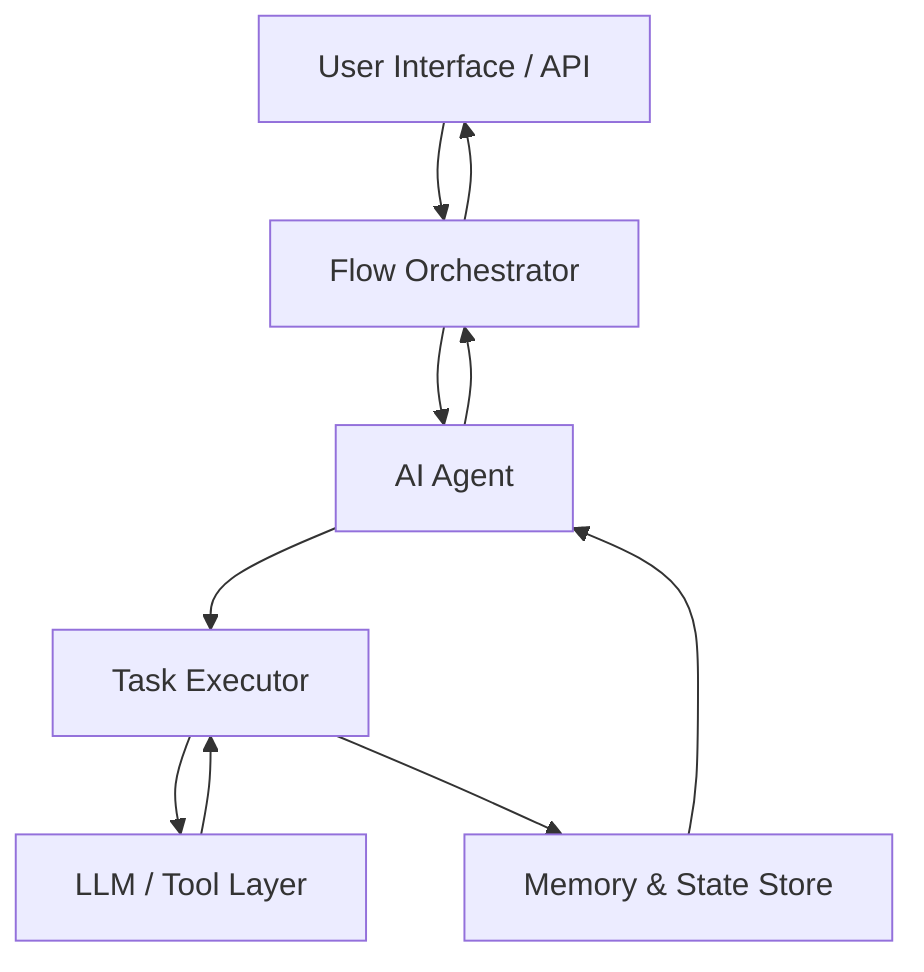
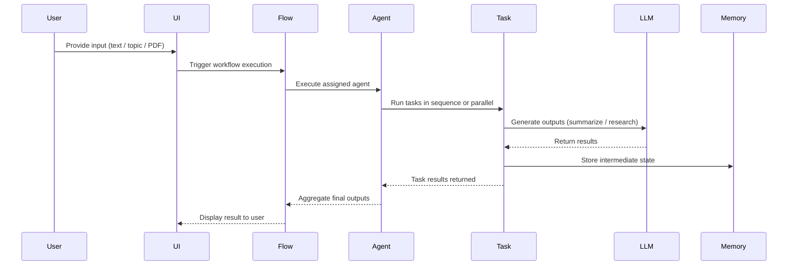

# 🤖 Build-Your-Own Agentic AI Framework

> **Intel® Unnati Industrial Training Program – 2025**  
> **Problem Statement:** *Build an AI Agent Framework (not just an app)*  

---

## 🌟 Project Overview

This repository contains a **from-scratch implementation of an Agentic AI Framework** that enables the creation, orchestration, execution, and monitoring of **agent-based workflows**.

The goal of this project is **not** to build a single AI application, but to design a **reusable framework** that supports:

- Agent abstractions
- Task-based workflows
- Flow orchestration
- State & memory management
- Observability
- UI & API interaction

All orchestration logic is **custom-built** without using any existing agent frameworks.

---

## 🎯 What We Have Successfully Built

### ✅ Core Framework Capabilities

✔ Agent abstraction  
✔ Task abstraction  
✔ Flow-based orchestration  
✔ Execution engine  
✔ Memory & state persistence  
✔ LLM integration layer  
✔ UI for interacting with agents  
✔ Multiple reference agents  

This satisfies the requirement of building a **true Agent Framework**, not a single-purpose app.

---

## 🧠 Why This Is a Framework (Not an App)

| Aspect | Explanation |
|-----|------------|
| Reusable | New agents & flows can be added easily |
| Extensible | Core does not change when adding agents |
| Modular | Agents, tasks, flows, UI are decoupled |
| Orchestrated | Execution is controlled via flows |
| Observable | State is stored & auditable |
| SDK-like | Agents callable via Python APIs |

---

## 🚫 Explicit Declaration (Important)

This framework **does NOT use**:

- ❌ CrewAI  
- ❌ AutoGen  
- ❌ LangGraph  
- ❌ LangChain Agents  
- ❌ n8n / Temporal / Airflow  

All agent orchestration and execution logic is **self-implemented**.

---

## 🏗️Architecture




## ⚡ End-to-End Execution Flow



---
## 🚀 Quick Start / How to Run

Follow these steps to quickly get the AI Agent Framework up and running:

1️⃣ Clone the Repository
```bash
git clone https://github.com/cvenugopal2005/agentic-ai-framework.git
cd agentic-ai-framework
```

2️⃣ Install Dependencies
```bash
pip install -r requirements.txt
```

3️⃣ Run the Streamlit UI
```bash
streamlit run ui.py
```
Choose an agent: Summarizer Agent or Research Agent
Provide input (text / PDF for summarizer, topic for researcher)
Click the centered button to generate results

4️⃣ Run Example Scripts / Agents
```bash
python flows/summarize_flow.py       # Summarizer agent workflow

python flows/research_flow.py        # Research agent workflow
```

🗂️ Project Structure
A clear folder & file structure of the framework:

```graphql

intel-agent-framework/
├── agents/                  # Agent definitions
│   ├── research_agent.py
│   └── summarizer_agent.py
├── api/                     # REST API endpoints
│   └── app.py
├── core/                    # Core framework SDK
│   ├── agent.py
│   ├── executor.py
│   ├── memory.py
│   └── task.py
├── flows/                   # Workflow implementations
│   ├── research_flow.py
│   └── summarize_flow.py
├── llm/                     # LLM client integrations
│   └── ollama_client.py
├── storage/                 # State & memory persistence
│   ├── state.json
│   └── state_store.py
├── utils/                   # Utility scripts
│   └── pdf_reader.py
├── ui.py                    # Streamlit UI
├── main.py                  # Entry point for CLI / orchestrator
├── requirements.txt         # Python dependencies
└── README.md                # Project documentation
```

## ⚡ Intel® OpenVINO™ Optimization

This framework is ready for Intel® OpenVINO optimization. Current and planned modules:

| Module | Status | Expected Improvement |
|--------|--------|--------------------|
| Text Classification (Summarizer) | ✅ Implemented | 30–40% faster inference |
| Text Embeddings (RAG / Search) | ✅ Implemented | 60% higher throughput |
| Future LLM Integrations | ⚙ Planned | 1.5x–3x speedup on Intel CPUs |

💡 **Tip:** OpenVINO provides best acceleration on Intel® processors (CPU, iGPU, VPU).

## 🏁 Conclusion

This **Agentic AI Framework** demonstrates the complete journey from designing reusable agent abstractions to orchestrating complex workflows, managing state, integrating tools/LLMs, and providing observability—all built **from scratch in pure Python** without relying on any existing agent frameworks.

The framework provides:

- Modular, extensible SDK for creating new agents and workflows  
- Flow orchestration with task dependencies and parallel execution  
- Memory and state management for reproducible workflows  
- Observability via structured logging and audit trails  
- Integration with Intel® OpenVINO™ for optimized ML inference  

We acknowledge the **Intel® Unnati Industrial Training Program 2025** for providing the problem statement, mentorship, and the platform to explore AI agent frameworks and Intel® optimization techniques.

> Built with ❤️ by our team for Intel® Unnati Industrial Training Program 2025
